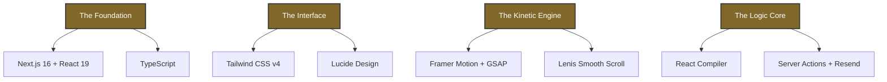

<p align="center">
  
</p>

# 🏛️ RMJ IT SOLUTIONS
### *Engineering Digital Infrastructure That Scales.*

---

## 💎 The Essence
**RMJ IT SOLUTIONS** isn't just a development firm; we are architects of institutional-grade digital ecosystems. We build the silent, powerful infrastructure that drives global-scale organizations.

> "We don't just write code; we engineer resilience."

---

## 🛠️ The Engineering Blueprint
Our digital infrastructure is forged with a high-performance stack, engineered for institutional scale and precision.



### ⚡ Technical Specifications
- **Core Architecture**: `Next.js 16.1.6` — The cutting edge of full-stack React.
- **Rendering Engine**: `React 19` + `Experimental React Compiler` — Auto-memoization for zero-overhead UI.
- **Styling Matrix**: `Tailwind CSS v4` — Low-level utility control with modern CSS capabilities.
- **Kinetic System**: `GSAP` & `Framer Motion` — Creating a fluid, high-fidelity interactive experience.
- **User Physiology**: `Lenis` — Optimized inertial scrolling for premium tactile feedback.
- **Data Conduit**: `Server Actions` — Type-safe, zero-API-boilerplate data mutations.

---

## 🏛️ Project DNA
A glimpse into how we structure excellence.

```bash
src/
├── 🛸 app/             # The Command Center (App Router & Global Layouts)
├── 🧱 components/      # The Atomic Units
│   ├── ✨ animations/  # Physics-based motion wrappers
│   ├── 🏗️ sections/    # Institutional Pillars (Hero, Capabilities, Trust)
│   └── 💠 ui/          # Micro-interactions & Design System Atoms
├── ⚙️ lib/             # The Engine Room (Shared Logic & Utilities)
└── 🎨 public/          # Visual Assets & Brand Identity
```

---

## ⚖️ The Gold Standard
Why our implementation stands apart:

*   **Institutional Authority**: High-contrast typography and intentional whitespace.
*   **The Golden Ratio Palette**: A curated mix of **Rich Gold** (`#816729`) and **Deep Charcoal**.
*   **Performance First**: Every micro-interaction is tuned for sub-60ms response times.
*   **Resiliency**: Built-in error boundaries and optimistic UI patterns.

---

## 🚀 Deployment Command
Ready to initiate the local environment?

```bash
# 1. Clone the Blueprint
git clone https://github.com/SaiDheeraj-19/RMJ-IT-SOLUTIONS.git

# 2. Synchronize Dependencies
npm install

# 3. Ignite Engine
npm run dev
```

---

<p align="center">
  
</p>

<p align="center">
  <b>RMJ IT SOLUTIONS — DEPLOYED BY R SAI DHEERAJ</b><br>
  <i>Built for Performance. Designed for Impact.</i>
</p>
