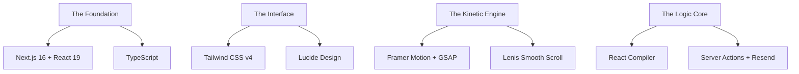

<p align="center">
  
</p>

# RMJ IT SOLUTIONS
### Institutional Infrastructure & Strategic Digital Implementation

<p align="center">
  
</p>

---

## 🏛️ The Vision
RMJ IT SOLUTIONS is a premium technology implementation firm dedicated to building, enabling, and operating technology-driven programs at institutional scale. We bridge the gap between complex infrastructure requirements and seamless digital execution.

## 🚀 Core Capabilities
We deliver global-grade digital infrastructure for organizations that cannot afford to fail.

- 🌐 **Web Applications**: High-performance, scalable enterprise web solutions.
- 📱 **Mobile Development**: Native-grade Android & iOS applications.
- ☁️ **Cloud Solutions**: Resilient architecture and managed cloud support.
- 🛡️ **Cybersecurity**: Advanced threat protection and infrastructure hardening.
- 🧠 **AI & Analytics**: Data-driven insights and institutional intelligence.
- 🏢 **ERP Integration**: Seamless synchronization of organizational resources.

## 🛠️ The Engineering Blueprint
Our digital infrastructure is forged with a high-performance stack, engineered for institutional scale and precision.



### ⚡ Technical Specifications
- **Core Architecture**: `Next.js 16.1.6` with the latest **App Router** paradigm.
- **Rendering Engine**: `React 19` powered by the **Experimental React Compiler** for auto-optimized performance.
- **Styling Matrix**: `Tailwind CSS v4` for utility-first precision and **Modern CSS Variables**.
- **Kinetic System**: A hybrid motion engine combining `Framer Motion` for reactive UI and `GSAP` for complex timelines.
- **User Physiology**: `Lenis` integration for buttery-smooth inertial scrolling.
- **Data Conduit**: `Resend` integration for high-deliverables transactional communications.


## 💎 Design Philosophy
- **Institutional Authority**: High-contrast, bold typography and generous whitespace.
- **Premium Aesthetics**: Curated gold-and-charcoal palette (`#816729`).
- **Seamless Motion**: Intentional, non-distracting micro-interactions.
- **Micro-Detailing**: Glassmorphism, subtle gradients, and custom SVGs.

## 📥 Getting Started

### Prerequisites
- Node.js 18.x or higher
- npm / yarn / pnpm

### Installation
1. **Clone the repository**
   ```bash
   git clone https://github.com/SaiDheeraj-19/RMJ-IT-SOLUTIONS.git
   cd RMJ-IT-SOLUTIONS
   ```

2. **Install dependencies**
   ```bash
   npm install
   ```

3. **Run the development server**
   ```bash
   npm run dev
   ```

## 📂 Project Structure
```bash
src/
├── app/            # Next.js App Router (Pages & API)
├── components/     # UI components and Section-based layout
│   ├── animations/ # Reusable motion wrappers
│   ├── sections/   # Major page components (Hero, Features, etc.)
│   └── ui/         # Base atoms and design system elements
├── lib/            # Utility functions and shared logic
└── public/         # Static assets and custom SVG illustrations
```

---

<p align="center">
  <b>Built for Performance. Designed for Impact.</b><br>
  Developed by R SAI DHEERAJ
</p>
